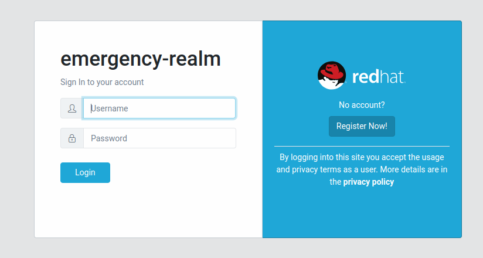

# Emergency-SSO
Custom theme and RH-SSO configuration

## Deploying
If the [RH-SSO 7.3 Openshift templates](https://github.com/jboss-container-images/redhat-sso-7-openshift-image/tree/sso73-dev) are not installed, run the `ocp-install-templates.sh` script.

Once the 7.3 image stream and templates are installed, run the `oc-deploy-sso.sh` script. This will create a custom image with the `themes` folder installed and then deploy that custom image with the `sso73-x509-postgresql-persistent.json` template.

